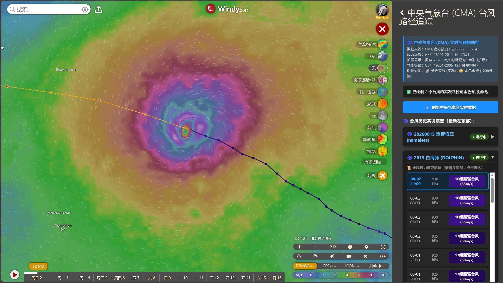

# windy-plugin-cma-typhoon

[](https://www.windy.com)
[](https://github.com/jianghanzhi2006-dotcom/windy-plugin-cma-typhoon/actions/workflows/ci.yml)
[-red.svg>)](https://typhoon.nmc.cn)
[](LICENSE)

A third-party [Windy.com](https://www.windy.com) plugin for tracking Western Pacific typhoons with China Meteorological Administration (CMA) observed and forecast data.

## Standards and the extended Level 18

- **Wind force Levels 0–17:** CMA supplies the tropical cyclone's 2-minute average maximum wind speed; the plugin maps that value to the wind-speed bands in **GB/T 28591-2012, Wind scale**. Under that standard, Level 17 starts at 56.1 m/s and has no separate upper level.
- **Level 18 (extended):** the plugin keeps an additional `> 61.2 m/s` display band because it makes exceptionally intense points easier to distinguish on the map. It is labeled **“18级（扩展）/ Level 18 (extended)”** throughout the UI and is a visualization convention of this plugin, not a level defined by GB/T 28591-2012.
- **Tropical-cyclone categories:** descriptions from tropical depression through super typhoon follow the 2-minute average wind ranges in **GB/T 19201-2006, Grade of tropical cyclones**.

## Features

- 📡 **Live CMA data:** requests observed tracks and CMA forecast points directly from `typhoon.nmc.cn`.
- 🌈 **Color-coded track segments:** each observed segment is colored by wind force for quick intensity comparison.
- 🟡 **Golden dashed forecast line:** renders available CMA forecast points as a separate dashed path.
- 🗂️ **Collapsible storm histories:** keeps at most one typhoon history expanded at a time and opens the currently strongest successfully loaded system by default.
- 🕒 **Beijing-time conversion:** converts source timestamps from UTC to Beijing Time (UTC+8).
- 🖱️ **Interactive, touch-friendly points:** larger transparent hit areas make observed and forecast nodes easier to select.
- 🔄 **Controlled refresh lifecycle:** only one CMA refresh request stays active; closing the plugin cancels it and removes the plugin's own map listener and layers.

## Screenshot



## Installation status

Version 1.0.1 has been uploaded through Windy's official `publish-plugin` GitHub Actions workflow. Version 1.0.2 is the current review candidate. After Windy approves and lists the plugin, it can also be found from Windy's Plugins panel.

For local development, follow Windy's plugin-development setup and load this repository in developer mode.

## Development

```bash
npm ci
npm test
npm run typecheck
npm run start
```

Create the distributable files in `dist/` with:

```bash
npm run build
```

The plugin is read-only with respect to CMA: it requests public track data and does not submit data to the source service.

## License

[MIT License](LICENSE) © 2026
